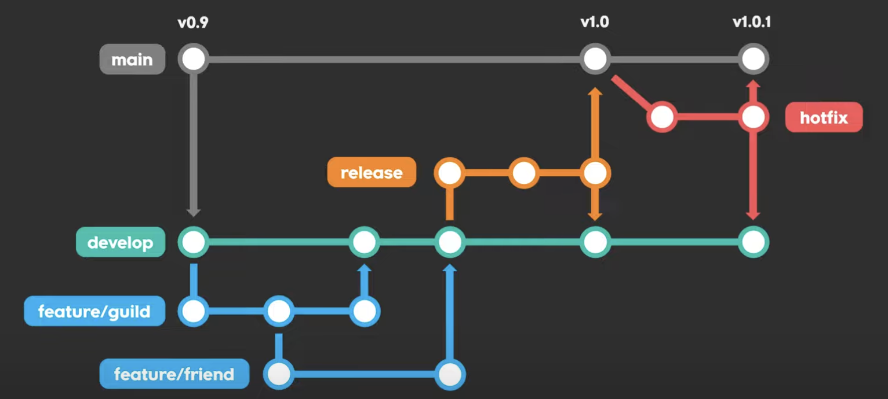
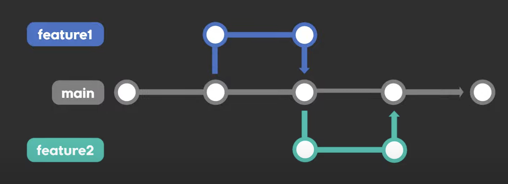

# 🧭 Git 브랜치 전략 정리

## 1. Git Flow 전략

Git Flow는 **브랜치를 세분화해서 체계적으로 관리**하는 전략이다.  
여러 명이 협업할 때, 기능 개발·테스트·배포 과정을 명확히 구분할 수 있다.

### 🔹 주요 브랜치

| 브랜치 | 설명 |
|---------|------|
| **main** | 실제 배포용 브랜치. 유저들이 사용하는 버전 |
| **develop** | 개발용 브랜치. 새 기능들을 통합하고 테스트 |
| **feature/** | 기능 단위로 분리하여 개발하는 브랜치 |
| **release** | 배포 직전 점검 및 QA를 위한 브랜치 |
| **hotfix** | 배포 후 급하게 수정해야 하는 버그를 처리하는 브랜치 |

---

### 🔸 전체 과정 예시

1. `develop` 브랜치에서 `feature` 브랜치를 만들어 기능 개발  
2. 개발 완료 후 `develop`에 병합  
3. 배포 전 `release` 브랜치에서 테스트 및 버그 수정  
4. 최종 검증 후 `main`에 병합 및 버전 태깅  
5. 배포 후 긴급 수정이 필요할 경우 `hotfix` 브랜치를 만들어 수정 후 `main`과 `develop`에 병합  

---

### ✅ 장점
- 체계적이고 명확한 프로세스  
- 여러 명이 동시에 안정적으로 개발 가능  
- 버전 관리 및 배포 시점 구분이 쉬움  

### ⚠️ 단점
- 브랜치가 많아 복잡해질 수 있음  
- 작은 프로젝트나 빠른 배포에는 비효율적  

---

## 2. Trunk-Based 전략

Trunk-Based는 **하나의 main 브랜치(Trunk)** 중심으로 빠르게 개발하는 전략이다.  
대부분의 작업은 짧은 수명의 브랜치로 수행되고, 바로 main에 병합한다.

### 🔹 특징
- `main` 브랜치 하나를 중심으로 운영  
- 기능이 필요할 때마다 `feature` 브랜치를 잠깐 만들어 작업  
- 빠르게 main에 머지하여 최신 상태 유지  

---

### ✅ 장점
- 단순하고 빠른 배포 가능  
- 충돌 위험이 적고 CI/CD에 최적화  
- 스타트업이나 소규모 팀에 적합  

### ⚠️ 단점
- 브랜치가 짧게 유지되어 관리 부담 적지만, 실수 시 즉시 main에 반영될 위험  
- QA, 버전 관리 체계는 Git Flow보다 약함  

---

## 📌 정리 비교

| 항목 | Git Flow | Trunk-Based |
|------|-----------|--------------|
| **적합한 팀 규모** | 중대형 팀, 협업 중심 | 소규모 팀, 빠른 배포 중심 |
| **브랜치 구조** | 복잡 (5개 이상) | 단순 (main 중심) |
| **배포 주기** | 느림 | 빠름 |
| **안정성** | 높음 | 상대적으로 낮음 |

---

> **추천:**  
> - 프로젝트 규모가 크고 배포 주기가 길면 → **Git Flow**  
> - 프로젝트 규모가 작고 빠른 업데이트가 필요하면 → **Trunk-Based**
